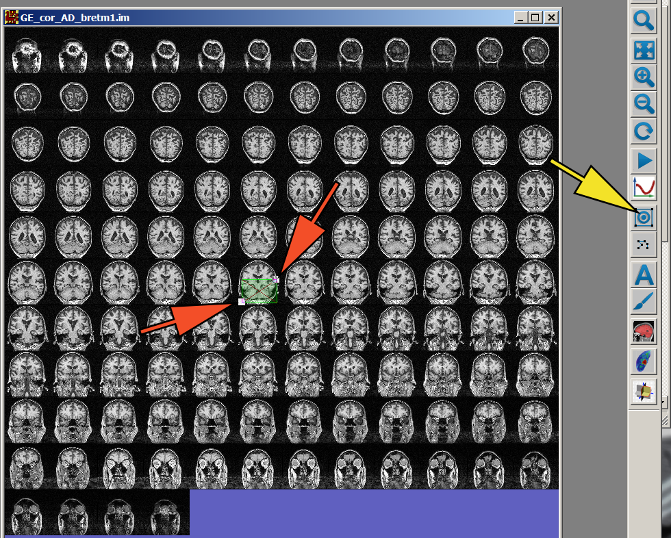

============
Vector ROIs
============

What is a vector ROI (VROI)
---------------------------

**Vector ROI (VROI)** is a tool for defining rectangular (box-like) regions of interest (ROIs).
It is used for landmarking, measuring distances, and cropping.

Create new VROI
----------------

**Create new VROI:** Click Draw VROI icon (:numref:`CreateVROI`).
Then click on the lower-left coordinate of the box, drag the mouse
to the upper-right coordinate, release the mouse button and click.
A green rectangle will appear on the image.

.. _CreateVROI:

    Click Add VROI icon and drag to draw a rectangular VROI.

Resize or move VROI
-------------------

* **Activate VROI:** Click on VROI to activate it. This brings up two white corners or "handles"
  (red arrows in :numref:`CreateVROI`).
* **Resize VROI:** Left-click and drag the handles to change size of VROI.
* **Move VROI:** Hold down the right mouse button to move VROI without changing its dimensions.
* **De-activate VROI:** Left-click VROI or another existing VROI to de-activate the current VROI.

Multislice VROIs
----------------

The new VROI initially spans one slice in Z-dimension (across slices).
If your image set is a time series (with 4 dimensions), the new VROI spans one time point in the time dimension.

To extend the VROI to more than one slice, it will be convenient to quickly estimate its first and last slice
on the film view.

**Example:** To enclose the cerebellum inside VROI, hover the mouse on the first and the last slice
and read the corresponding slice numbers on the mouse tracker panel
in the lower left margin of the image window (:numref:`MultisliceVROI`, green arrow).

Hover the mouse above the first and last slice and note the slice numbers on the mouse tracker panel (green arrows).

Then type the slice numbers as z0 and z1 coordinates of the VROI.

.. _MultisliceVROI:

    Multislice VROI.

VROI properties
---------------

Double-click the VROI.
A VROI properties dialog box will appear (:numref:`PropertiesVROI`).

.. _PropertiesVROI:

    VROI properties dialog box.

**Name:**
Allows you to assign a name to the VROI.
The name is required if VROI is used for fiducial landmarks.

**Coordinates:**
Contains the coordinates of the corners of the VROI rectangle.
The coordinates are expressed in voxels.
Each field can be changed by typing in a new value.
Navigate to the next field by pressing Tab.

**Dimensions:**
Contains the dimensions of the VROI expressed in voxels or millimeters (\"units\" radio buttons).
These values can also be changed -- the center of the VROI remains fixed.

**Time Interval:**
For 4D images only.
Allows you to specify the starting and ending time points.
Or click \"All Timepoints\” button to apply to the entire time series.

**Full Volume:**  Click to include the entire field of view in VROI.

**Center:** Click to attempt to move ROI so its 3D center would match the 3D center of the Volume.

Also note Crop commands under Volume menu.
These commands are used to crop current image.

After generating a VROI, it might be useful to inspect its extent in 3 dimensions.
This is done by clicking on 3 orthogonal projections icon -- the lowest icon on FireVoxel toolbar.

Find and manage VROIs
---------------------

The first five items under ROI menu are helpful in managing multiple ROIs:

**List** -- Display the list of current VROIs.

**Load** -- Retrieve previously saved VROI from a file.

**Save** -- Save all existing VROIS in a text file. The file extension is .vroi.
Note that saving the entire document in FireVoxel .fvx format will also save VROIs.

**Next or F11** -- Display the next VROI and make it active.

**Delete** -- Delete VROIs. You also delete an active VROI by pressing the Delete key.

There is also a tool to convert a raster ROI (created using paintbrush) to VROI:
ROI--> Enclose connected components by VROIs.

Crop using VROI
---------------

1. Define your VROI. If your base image is 4D, pay attention at which timepoints are included.
2. Select the desired cropping operation under Volume --> Crop.
   Note that some cropping tools operate on selected image layers,
   other will crop all the layers. Simple cropping, like single slice cropping, don't need VROI.

Measure distance using VROI
---------------------------

The distance between two points on a slice can be measured using an VROI and a calculator.

1. Create a VROI that encloses the object of interest (e.g., kidney, :numref:`MeasureDistance`).

2. Open VROI properties dialog box. Set the units to mm. Record the VROI dimensions.

3. Calculate the distance using the width and height of VROI:
   :math:`distance = \sqrt{width^2 + height^2}`.

.. _MeasureDistance:

    Measure kidney size with VROI.

Use VROIs for landmark-based coregistration
-------------------------------------------

Multiple VROIs can be used for 3D image coregistration
based on corresponding landmarks.
The user needs to enter VROI names to label matching landmarks.

